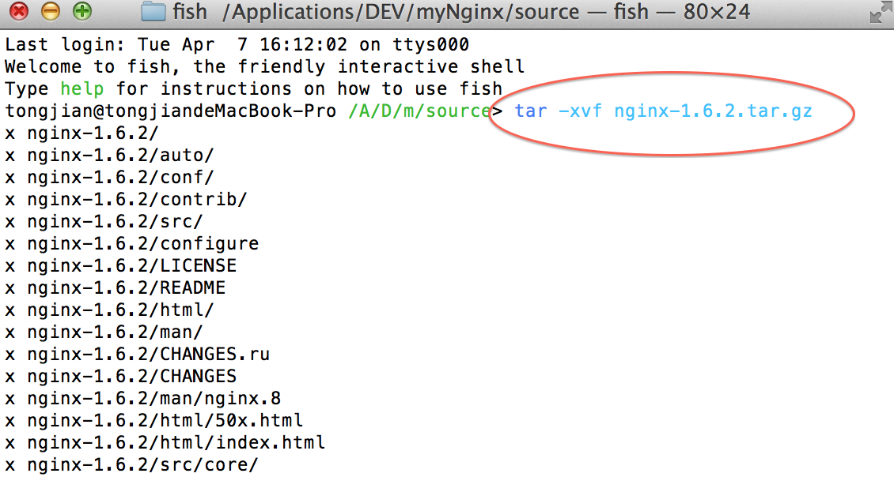
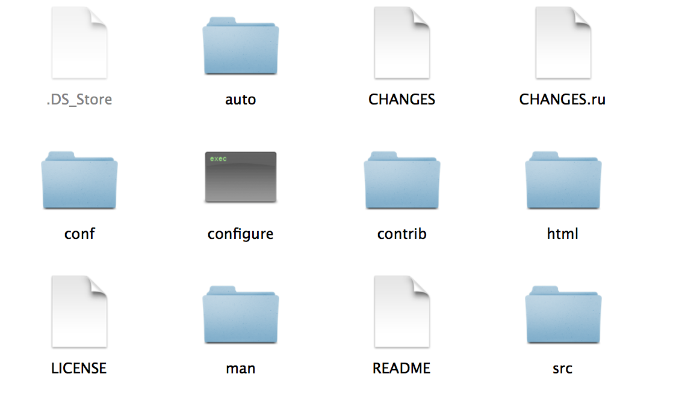
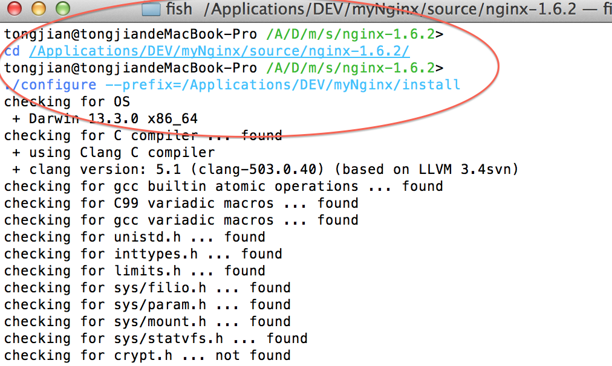
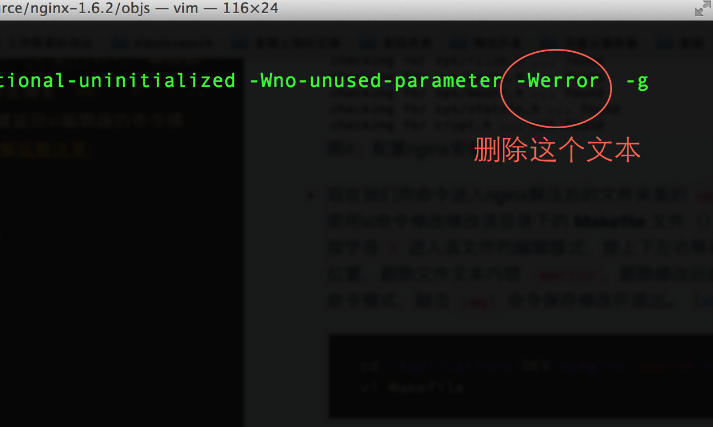
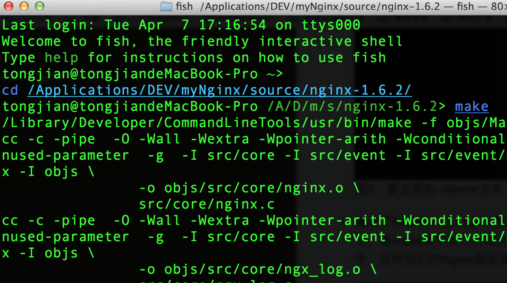
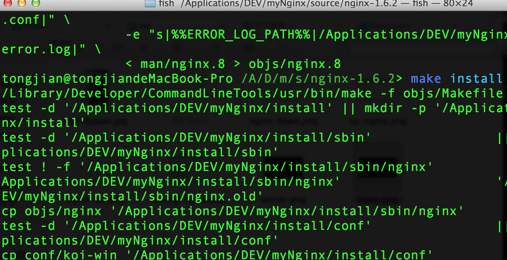
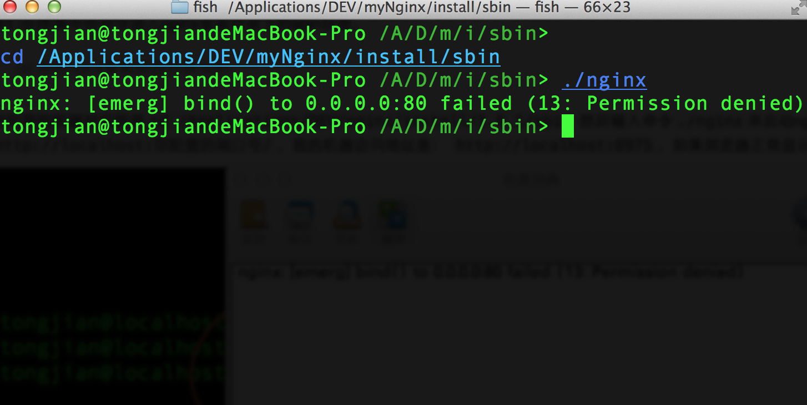
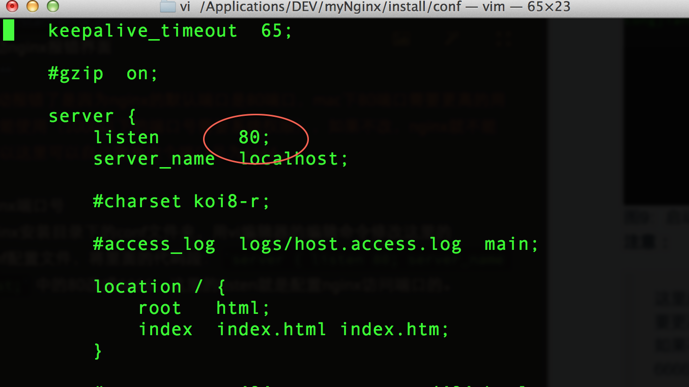
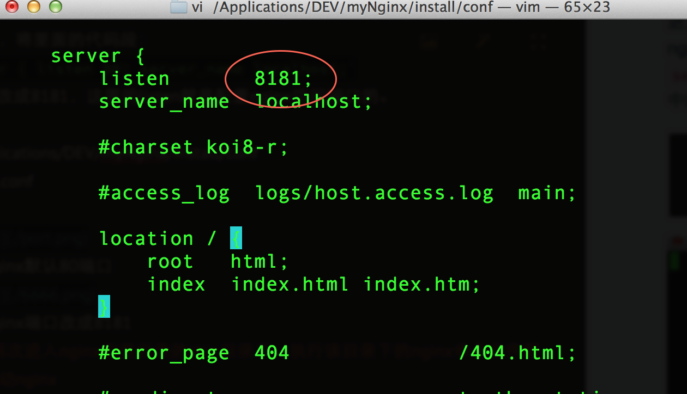
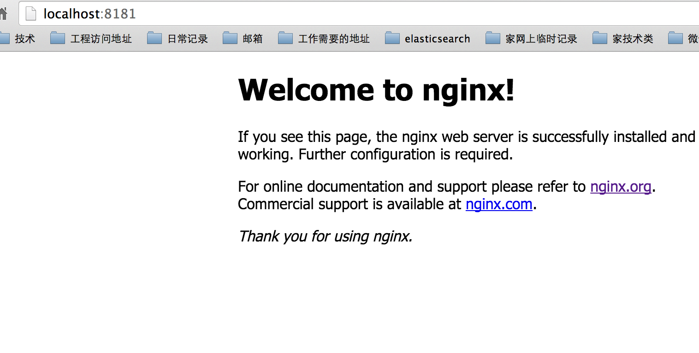

# 欢迎阅读Nginx<br />分享
----

```
	<select id="xxx">
	SELECT 1 FROM DUAL
	   WHERE 1 = 1
	   <isEmpty property="name">
	     AND name = #name#
	   </isEmpty>
   <isNotEmpty property="name">
     AND id = #id#
   </isNotEmpty>
   </select>
```

## Nginx简介

#### Nginx是什么？

> Nginx是`engine	['endʒɪn] X`的简写，是一款轻量级的Web 服务器/反向代理服务器及电子邮件（IMAP/POP3）代理服务器，并在一个BSD-like 协议下发行。由俄罗斯的程序设计师Igor Sysoev所开发，供俄国大型的入口网站及搜索引擎Rambler（俄文：Рамблер）使用。其特点是占有内存少，并发能力强，是目前市面上唯一能和kangleweb server比拼的web server，事实上nginx的并发能力确实在同类型的网页服务器中表现较好，中国大陆使用nginx网站用户有：新浪、网易、腾讯等。[详情猛戳这里](http://baike.baidu.com/view/926025.htm?fr=aladdin)

###### 总结：
- 定义： 轻量级、高性能、开源的web服务器 
- 主要功能：Http服务器、反向代理服务器、邮件服务器
- 为什么用它：
更快、 高扩展性、 高可靠性低内存消耗、
单机支持10万以上的并发连接、
热部署、最自由的BSD许可协议
- 谁在用Nginx：
  *国外* **ordpress Sourceforge Github Hulu ...**
  *国内* **新浪 网易 搜狐 校内 迅雷 CSDN...**

#### 作者的美貌？

###### 大名： Igor Sysoev 伊戈尔 塞索耶夫

----

## 下面介绍在Mac下安装和部署Nginx

#### 获取Nginx安装包
- 我们先去官网下载最新的稳定版的Nginx包，然后将其解压放到指定目录，我的机子解压后放在了/Applications/DEV/myNginx/source目录。

图1：Nginx下载界面（[立即下载](http://nginx.org/download/nginx-1.6.2.tar.gz)）

- 在这个目录下将其解压

图2：解压Nginx

- 解压后的Nginx的目录结构如下

图3：Nginx目录结构

#### Nginx安装步骤
- 打开终端，进入Nginx解压目录
`cd /Applications/DEV/myNginx/source/nginx-1.6.2/`

- 执行命令：`.configure prefix = 你的nginx准备安装的目录`
这个命令会配置nginx的安装路径，res/configure表示在当前这个路径下找configure这个命令来执行，我的nginx准备安装在/Applications/DEV/myNginx/install下面，所以我的命令是：` ./configure prefix=/Applications/DEV/myNginx/install`

图4：配置nginx安装路径

- 现在我们用命令进入nginx解压后的文件夹里的 `objs` 目录下，
 使用vi命令修改修改该目录下的 **Makefile** 文件（）：`vi Makefile`, 然后按字母 `i` 进入该文件的编辑模式，按上下左右移动光标去需要改动的代码位置，删除文件文本内容 `-Werror`，删除修改后按 **esc** 键返回vi编辑器的命令模式，敲击 `:wq!` 命令保存修改并退出。（[vi编辑器详解猛戳这里](http://baike.baidu.com/view/908054.htm?fr=aladdin)）
 ```
 cd /Applications/DEV/myNginx/source/nginx-1.6.2/objs
 vi Makefile 
 ```

图5：要去除的-Werror文本

- 修改了Makefile进入nginx解压后的根目录，在这个路径下执行 `make` 命令，等make命令执行后相关信息输出完毕再执行命令：` make install` 命令，这样我们的Nginx就安装成功了。
 ```
cd /Applications/DEV/myNginx/source/nginx-1.6.2/
make
make install
```

图6：进入nginx解压根目录执行make命令

图7：执行make install命令安装nginx

- 安装nginx成功之后会在图4中prefix值所示的目录中生成安装后的文件

图8：nginx安装后生成的文件

##### 至此，nginx就已经安装完成了... 如果你按照上面的步骤成功安装nginx，那么，恭喜发财，如果你还在痛苦着，那么你也不会快乐着，继续装吧！

####启动和访问nginx首页
- 启动nginx
 进入nginx安装目录的sbin目录下，执行该目录下的nginx命令文件即可。
 
 ```
cd /Applications/DEV/myNginx/install/sbin
res/nginx
 ```

图9：启动nginx报错界面
**注意 ：** 
> 这里启动报错了是因为nginx的默认端口是80端口，mac下80端口需要更高的用户权限才能使用（1000以下的端口号需要系统权限），如果不改，nginx就不能启动，所以这里可以自己随意改个端口号为8181。

- 修改nginx端口号
进入nginx安装目录下的conf文件夹，用vi编辑器的编辑命令修改这里的nginx.conf配置文件，将里面的代码段： 
   `server { listen 80; server_name localhost;` 
   中的80改成8181，这里的listen就是配置nginx访问端口的。
   ```
  cd /Applications/DEV/myNginx/install/conf 
  vi nginx.conf
   ```

图10：nginx默认80端口
 
图11：nginx端口改成8181
>接下来再次进入nginx安装目录的sbin目录下，执行下面的命令重新加载一下nginx的配置即可以最新的配置重启nginx。
 ```
 cd /Applications/DEV/myNginx/install/sbin
res/nginx -s reload
 ```
 
- 访问nginx首页测试nginx是否启动成功
打开浏览器，输入地址`http://localhost:8181/`,如果成功看见nginx的欢迎页面，则表示安装-配置-启动nginx一套拳全部打完。
 

----

## 经过上面的步骤，Nginx已经成为了mac的一部分了。由于nginx篇幅太多，无法细说，所以大致给大家介绍下他的静态资源服务器和反向代理部分内容
